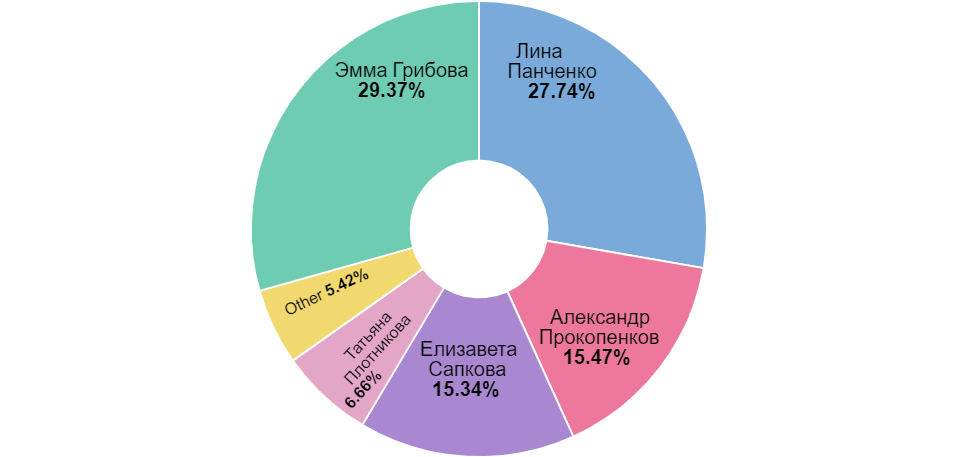
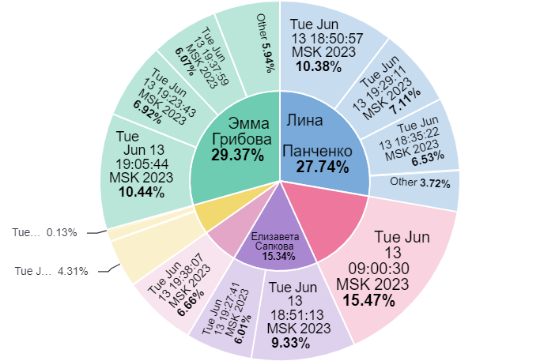

### Агрегация по авторам


### Агрегация по авторам и датам


### Поиск документов, в которых в заголовке или в тексте есть слово "Путин"
```agsl
GET news/_search
{
  "query": {
    "combined_fields": {
      "query" : "Путин",
      "fields": ["title", "cotext"]
    }
  }
}
```
### Поиск документов, в которых в заголовке или в тексте есть слово "Путин" или "Кадыров"
```agsl

GET news/_search
{
  "query": {
    "combined_fields": {
      "query" : "Путин Кадыров",
      "fields": ["title", "cotext"],
      "operator": "or"
    }
  }
}
```

### Поиск документов, в которых в заголовке или в тексте есть слово "Пригожин" и "Кадыров"
```agsl
GET news/_search
{
  "query": {
    "combined_fields": {
      "query" : "Пригожин Кадыров",
      "fields": ["title", "cotext"],
      "operator": "and"
    }
  }
}
```

### Комбинация запросов
```agsl
GET news/_search
{
  "query": {
    "bool": {
      "should": [
        {
          "query_string": {
            "fields": ["title", "cotext"],
            "query": "(Путин) OR (Шойгу)"
          }
        },
        {
          "match_phrase": {
            "text": "Лукашенко"
          }
        }
      ]
    }
  }
}
```
### Агрегация по авторам
```
GET news/_search
{
  "aggs": {
    "0": {
      "terms": {
        "field": "author.keyword",
        "order": {
          "_count": "desc"
        },
        "size": 10
      }
    }
  },
  "size": 0,
  "script_fields": {},
  "stored_fields": [
    "*"
  ]
}
```
